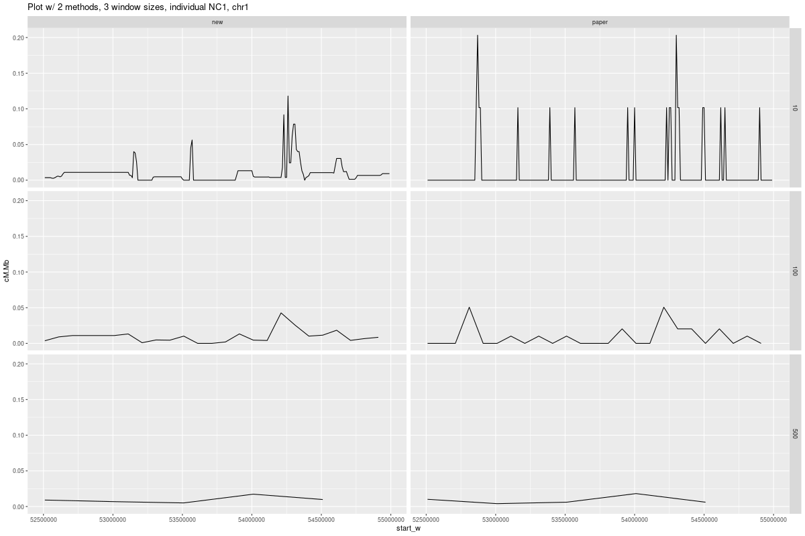
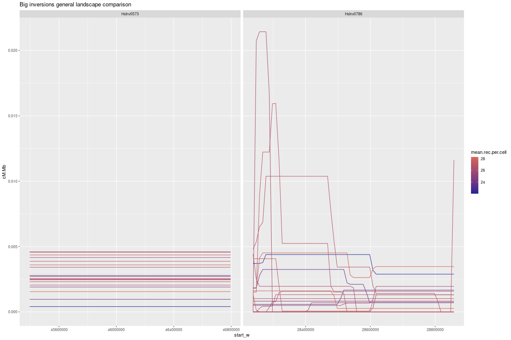
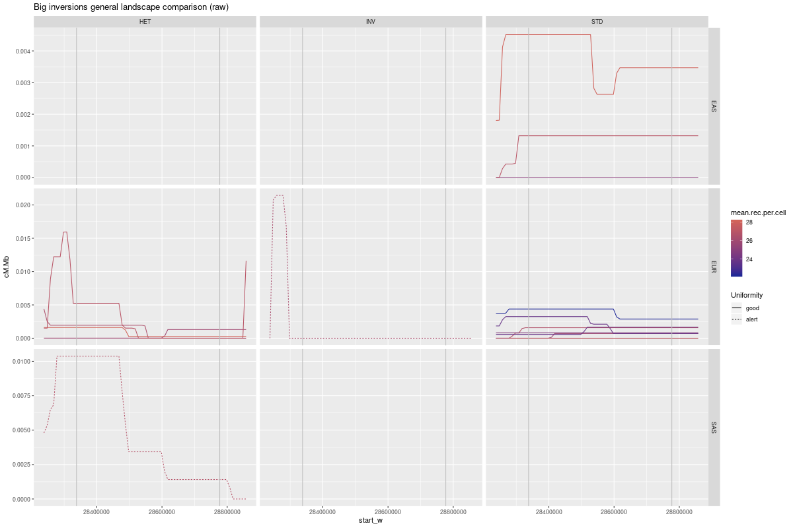
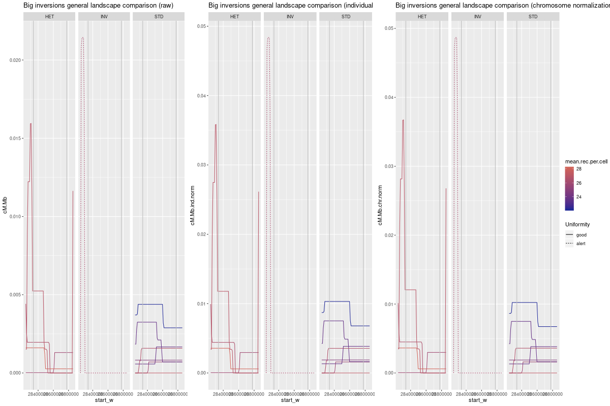
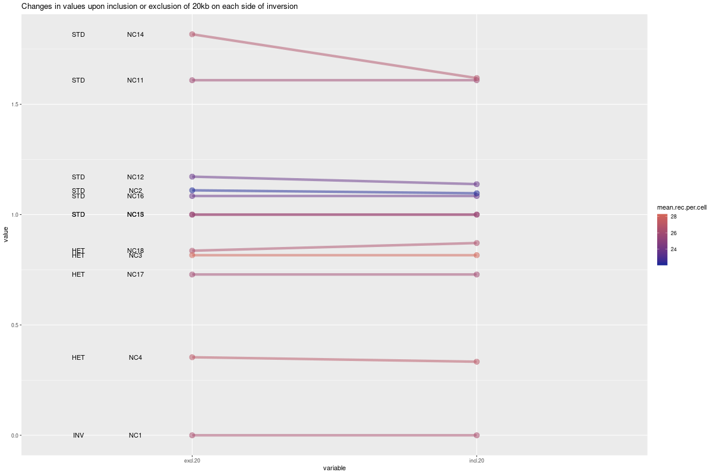
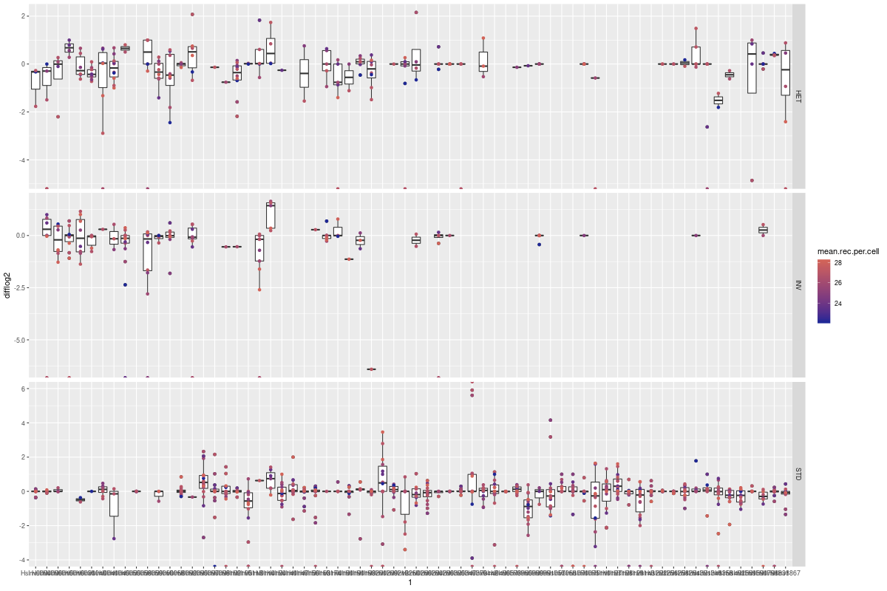

<style type="text/css">

.main-container {
  max-width: 1280px;
}

</style>
```{r setup, include=FALSE}
require("knitr")
require("tidyr")
require("ggforce")
require("stringr")
# opts_knit$set(root.dir = "/run/user/1001/gvfs/sftp:host=158.109.38.201,user=rgomez/home/rgomez/20200401_RealRecombination")
outdir<-"report/2020-05-29_crossoverSummary/deliver/images/"
```


# El nostre mètode causa esbiaixos?

## Take samples

1-point vs proportional region
0-based coordinates assumed

```{r papermap, echo = FALSE, eval=FALSE}

## Take samples as in paper in recombination rate


load("analysis/2020-07-29_09_crossovers_paperMap10/crossoverResult.Rdata")
recMap.p<-data.frame(recMap, window="10")
load("analysis/2020-07-29_09_crossovers_paperMap100/crossoverResult.Rdata")
recMap.p<-rbind(recMap.p,data.frame(recMap,  window="100"))
load("analysis/2020-07-29_09_crossovers_paperMap500/crossoverResult.Rdata")
recMap.p<-rbind(recMap.p,data.frame(recMap,  window="500"))
recMap.p$group<-"paper"


## Take samples by our method in recombination rate

load("analysis/2020-07-29_09_crossovers_newMap10/crossoverResult.Rdata")
recMap.n<-data.frame(recMap, window="10")
load("analysis/2020-07-29_09_crossovers_newMap100/crossoverResult.Rdata")
recMap.n<-rbind(recMap.n,data.frame(recMap,  window="100"))
load("analysis/2020-07-29_09_crossovers_newMap500/crossoverResult.Rdata")
recMap.n<-rbind(recMap.n,data.frame(recMap,  window="500"))
recMap.n$group<-"new"

# Clean
rm(recMap)

# Join all
recMap.all <- rbind(recMap.n, recMap.p)

``` 

## Statistics

**The paired T-test**

According to the statistics manual:

"Use the paired t–test when you have one measurement variable and two nominal variables, one of the nominal variables has only two values, and you only have one observation for each combination of the nominal variables; in other words, you have multiple pairs of observations."

## Are values different depending on  calculation method on window size?

```{r, echo = FALSE, eval=FALSE}

test<-recMap.all[recMap.all$chr_w == "chr1" & recMap.all$ind == "NC1" & recMap.all$start_w >52500000 & recMap.all$start_w <55000000 ,]
# ggplot(test)+geom_line(aes(x=start_w, y = cM.Mb, group = ind, color = ind))+facet_grid(window~group)+ggtitle("Plot with two methods,  one chr")

png(filename=paste0(outdir, "plot1.png"), width = 1200, height =800, units = "px" )
  ggplot(test)+geom_line(aes(x=start_w, y = cM.Mb))+facet_grid(window~group)+ggtitle("Plot w/ 2 methods, 3 window sizes, individual NC1, chr1")
dev.off()

save(recMap.all, file=paste0(outdir, "recMap.all.RData"))

```

```{r, echo = FALSE}
load("deliver/images/recMap.all.RData")

```
Com es pot veure a la següent figura, no sembla haver-hi molta diferència en la taxa de recombinació amb les finestres grans, pero a mesura que disminuim la mida de finestra augmenta la probabilitat del metode del paper de tenir valors equivalents a 0, el que podria donar problemes a causa de diferncies extremes entre els calculs d'un i l'altre metode. 





Per veure si el metode que triem afecta al resultat, farem un paired t-test,  que hauria de ser mes significatiu com mes petita la mida de finestra. 

```{r, echo = FALSE}


test_winsizes<-function(winsize){
  
  print(paste0("Now doing test with WINDOW SIZE = ", winsize, "kb"))
  subset<-recMap.all[recMap.all$window == winsize,]
  subset.paired <- reshape2::dcast(subset, chr_w + ind +start_w ~ group, value.var = "cM.Mb" )  
  
  
  t.test(subset.paired$new,
         subset.paired$paper,
         paired=TRUE, alternative = "two.sided") 
}


test_winsizes(500)
test_winsizes(100)
test_winsizes(10)

```

En principi no sembla que cap de les proves surti signiticativment diferent entre un mètode i l'altre amb un test bidireccional i interval de confiança de 0.95, pero si es veu la tendencia a ser més diferents les mesures com mes petites son les finestres.

Per veure que la mida de finestra no estigui afegint cap esbiaix, simplement compararia les diferents mides de finestra 2 a 2, pero no se com combinar cada 5 valors de 100kb per fer la mitjana en 500kb etc. 

<!-- ```{r, echo = FALSE} -->

<!-- test_winmethods<-function(winsize1, winsize2){ -->
<!--   print(paste0("Now doing test with WINDOW SIZES = ", winsize1, "kb and ", winsize2, "kb")) -->

<!--   times<-winsize1/winsize2 -->
<!--   vector<-recMap.all[recMap.all$window == winsize1,"start_w"] -->
<!--   t<-recMap.all[recMap.all$window == winsize2,] -->
<!--   rep(1:5, each=n) -->

<!--   subset<-recMap.all[recMap.all$window %in% c(winsize1, winsize2),] -->
<!--   subset.paired <- reshape2::dcast(subset, chr_w + ind +start_w + group ~ window, value.var = "cM.Mb" )   -->


<!--   t.test(subset.paired$new, -->
<!--          subset.paired$paper, -->
<!--          paired=TRUE, alternative = "two.sided")  -->
<!-- } -->


<!-- test_winsizes(500) -->
<!-- test_winsizes(100) -->
<!-- test_winsizes(10) -->

<!-- ``` -->


Com a molt, he pogut veure que passa quan faig la mitjana dels cromosomes per cada mètode i mida de finestra: 

```{r , echo = FALSE}
# Make means
recMap.means<-aggregate(cM.Mb ~ ind+chr_w+window+group, data=recMap.all, FUN=mean)

# Check assumptions for the test
# 
# # Differences are normally distributed
# recMap.means$diff<-recMap.means$new.mean-recMap.means$paper.mean
# hist(recMap.means$diff)


test_winmeans<-function(winsize){
  
  print(paste0("Now doing test with WINDOW SIZE = ", winsize, "kb"))
  subset<-recMap.means[recMap.means$window == winsize,]
  subset.paired <- reshape2::dcast(subset, chr_w + ind  ~ group, value.var = "cM.Mb" )  
  
  
  t.test(subset.paired$new,
         subset.paired$paper,
         paired=TRUE, alternative = "two.sided") 
}


test_winmeans(500)
test_winmeans(100)
test_winmeans(10)


```

Hi ha diferncies significatives entre metodes en la taxa mitjana del cromosoma, sigui quina sigui la mida de finestra.  

```{r , echo = FALSE}

test_winmeans.methods<-function(winsize1, winsize2){ 
   print(paste0("Now doing test with WINDOW SIZES = ", winsize1, "kb and ", winsize2, "kb")) 
  
  subset<-recMap.means[recMap.means$window %in% c(winsize1, winsize2),]
  subset.paired <- reshape2::dcast(subset, chr_w + ind + group ~ window, value.var = "cM.Mb" )  

    t.test(subset.paired[,as.character(winsize1)],
         subset.paired[,as.character(winsize2)],
         paired=TRUE, alternative = "two.sided") 
}

test_winmeans.methods(500, 100)
test_winmeans.methods(100, 10)


```

Hi ha diferencies significatives entre mides de finestra en la taxa mitjana del cromosoma, independentment del metode que s'hagi fet servir. Aquests esbiaixos son possiblement causats perque com més petita la mida de finestra, i especialment en el cas del metode fet servir enl'article original, mes finestres amb un valor de 0 hi ha. Aquest es un exemple simple de per que seria millor calcular directament els intervals que volem, enlloc de fer les mitjanes de finestres fixes preestablertes al llarg d'una regio. 


<!-- 

AQUI PROBE DE QITAR LOS 0 PERO ESTO NO TIENE MUCHO SENTIDO...
```{r, , fig.width=8, fig.height=6}} -->


<!-- recMap.no0<-recMap.all[recMap.all$paper != 0,] -->


<!-- # Global means test -->
<!-- # Make means -->
<!-- recMap.means.no0<-aggregate(paper ~ ind+chr_w+window, data=recMap.no0, FUN=mean) -->
<!-- recMap.means.no0<-merge(recMap.means.no0,aggregate(new ~ ind+chr_w+window, data=recMap.no0, FUN=mean)) -->
<!-- colnames(recMap.means.no0)[c(4,5)]<-c("paper.mean", "new.mean") -->


<!-- # Differences ARE NOT normally distributed... -->
<!-- recMap.means.no0$diff<-recMap.means.no0$new.mean-recMap.means.no0$paper.mean -->
<!-- hist(recMap.means.no0$diff) -->

<!-- # Test says means are different -->
<!--   t.test(recMap.means.no0[,"paper.mean"], -->
<!--        recMap.means[, "new.mean"], -->
<!--        paired=TRUE, -->
<!--        conf.level=0.95) -->

<!-- # Image showing means are different -->
<!--   plot(recMap.means.no0$diff, -->
<!--      pch = 16, -->
<!--      ylab="Difference (Paper – New)") -->

<!-- abline(0,0, col="blue", lwd=2) -->


<!-- ``` -->


# Hi ha diferncies en la taxa de recombinació dins vs. fora de les inversions?

## Text

He fet servir totes les coordenades que he trobat en hg38. 

La HsInv0573 y HsInv0786 haurien d'estar dividides en més finestres per un estudi mes exhaustiu, per exemple en finestres de 10kb amb 100kb a banda i banda. 


>> Afegir anotació sobre com era el filtratge dels genotips, recordo que era un metode mes laxe, pero potser s'hauria de revisar perque es saltava la 786 encara que una poblacio era imputable.
>> Iputació HsInv0501!!

## Big inversions study

```{r  , echo = FALSE, eval=FALSE}

# General chromosome data
load("analysis/2020-07-14_09_crossovers_byChromosome/crossoverResult.Rdata")
recMap.chr<-recMap
rm(recMap)

## Sample with fixed distance 100kb CI and 10kb windows
load("analysis/2020-07-30_09_crossovers_biginversions/crossoverResult.Rdata")

# Set donor colors
crossoverbed<-read.table("report/2020-05-29_crossoverSummary/allcrossovers.bed", header=TRUE)
counts<-data.frame(str_split_fixed(crossoverbed$donor_cell, "_", 2))
counts$counter<-1

counts.sum<-aggregate(counter ~ X1+X2, data=counts, FUN=sum)
counts.mean<-aggregate(counter ~ X1, data=counts.sum, FUN=mean)

colnames(counts.mean)<-c("ind", "mean.rec.per.cell")
rm(crossoverbed, counts, counts.sum)

recMap<-merge(recMap, counts.mean)

# A raw representation of the landscape
png(filename=paste0(outdir, "plot2.png"), width = 1200, height =800, units = "px" )
  ggplot(recMap)+geom_line(aes(x=start_w, y = cM.Mb, group = ind, color = mean.rec.per.cell))+facet_grid(.~inv, scales = "free") + ggtitle("Big inversions general landscape comparison")+scale_color_gradient(low = "#1f2896", high = "#d26459")
  
dev.off()
```


A la Figura 2 podem observar que la inversió HsInv0573 no presenta un escenari gaire variat al seu voltant i no hi podrem observar res. A la HsInv0786 es poden veure mes canvis i sebla que alguns tindrien una resolucio bastant fina, donat que es poden veure alguns pics concrets. Em centraré llavors en aquesta inversio. 




Tinc genotips aparentment de bona qualitat per varies poblacions, pero nomes els europeus consten com realment imputables. 

```{r  , echo = FALSE, eval=FALSE}

  # Get individuals genotypes
  genotypes<-read.table("analysis/2020-05-23_07_imputationTables/imputationResults.csv", header=TRUE, sep = ",")

  # Get individual names
  genotypes$Individual<-sub("^\\d+\\.","",genotypes$Individual)
  genotypes$Individual<-sub("nc", "NC", genotypes$Individual, ignore.case = FALSE)

  # Merge with info
  recMap<-merge(recMap[recMap$inv == "HsInv0786",], genotypes[genotypes$Inversion == "HsInv0786",], by.x = "ind", by.y = "Individual")

  # Solve a factor problem
  recMap$Uniformity<-factor(recMap$Uniformity, levels = c("good", "alert"))
  
  # A raw representation of the landscape
  png(filename=paste0(outdir, "plot3.png"), width = 1200, height =800, units = "px" )
  
    ggplot(recMap)+geom_line(aes(x=start_w, y = cM.Mb, group = ind, color = mean.rec.per.cell, linetype = Uniformity))+facet_grid(Population~Genotype_500, scales = "free") + ggtitle("Big inversions general landscape comparison (raw)")+scale_color_gradient(low = "#1f2896", high = "#d26459")+geom_vline(xintercept = c(28337952	,28777130), color = "gray")
    
  dev.off()


```

En la figura 3 es pot veure com es la situacio al voltant de la inversio. Els unics genotips fiables realment, com ja he dit, son els dels europeus. L'individu europeu marcat amb la linia de punts es heterozigot quan sel compara amb tots els altres europeus, i invertit quan sel compara amb els individus de la poblacio general mes semblants a ell. 

Aquesta figura no ha estat normalitzada per poder veure els efectes de diferents metodes de normalitzacio en les seguents figures. En endavant nomes es miraran individus europeus.



  **Comparacio de diferents metodes de normalitzacio**
  
  
```{r  , echo = FALSE, eval=FALSE}

  #  I need the mean value from chromosomes and individuals, which I have in a file
  
  recMap.chr<-recMap.chr[recMap.chr$score  > 0,]
  recMap.ind<-aggregate(cM.Mb  ~ ind,data = recMap.chr, FUN = mean)
  

# GENERAL

  # This plot for later
  a<-ggplot(recMap[recMap$Population == "EUR",])+geom_line(aes(x=start_w, y = cM.Mb, group = ind, color = mean.rec.per.cell, linetype = Uniformity))+facet_grid(.~Genotype_500, scales = "free") + ggtitle("Big inversions general landscape comparison (raw)")+scale_color_gradient(low = "#1f2896", high = "#d26459")+geom_vline(xintercept = c(28337952	,28777130), color = "gray")
    

# IDIVIDUAL
  recMap<- merge(recMap, recMap.ind[, c("ind",  "cM.Mb")], by = c("ind") )
  colnames(recMap)[colnames(recMap) %in% c("cM.Mb.x")]<-"cM.Mb"
  colnames(recMap)[colnames(recMap) %in% c("cM.Mb.y")]<-"cM.Mb.ind"
  recMap$cM.Mb.ind.norm<-recMap$cM.Mb / recMap$cM.Mb.ind
  
  b<- ggplot(recMap[recMap$Population == "EUR",])+geom_line(aes(x=start_w, y = cM.Mb.ind.norm, group = ind, color = mean.rec.per.cell, linetype = Uniformity))+facet_grid(.~Genotype_500, scales = "free") + ggtitle("Big inversions general landscape comparison (individual normalization)")+scale_color_gradient(low = "#1f2896", high = "#d26459")+geom_vline(xintercept = c(28337952	,28777130), color = "gray")
    
# CHROMOSOME + INDIVIDUAL

  recMap<- merge(recMap, recMap.chr[, c("ind", "chr_w", "cM.Mb")], by = c("ind", "chr_w") )
colnames(recMap)[colnames(recMap) %in% c("cM.Mb.x")]<-"cM.Mb"
  colnames(recMap)[colnames(recMap) %in% c("cM.Mb.y")]<-"cM.Mb.chr"
  recMap$cM.Mb.chr.norm<-recMap$cM.Mb / recMap$cM.Mb.chr
  
def.correction<-recMap.chr[, c("ind", "chr_w", "cM.Mb")]
  
  c<-ggplot(recMap[recMap$Population == "EUR",])+geom_line(aes(x=start_w, y = cM.Mb.chr.norm, group = ind, color = mean.rec.per.cell, linetype = Uniformity))+facet_grid(.~Genotype_500, scales = "free") + ggtitle("Big inversions general landscape comparison (chromosome normalization)")+scale_color_gradient(low = "#1f2896", high = "#d26459")+geom_vline(xintercept = c(28337952	,28777130), color = "gray")
    
# ALL TOGETHER
  
    png(filename=paste0(outdir, "plot4.png"), width = 1200, height =800, units = "px" )
  
  ggarrange(a, b,c, nrow=1, common.legend = TRUE, legend="right")
  
    dev.off()
```
  
  En general, la normalització no afecta molt a la forma de la distribucio, pero si als valors que agafa tot i que canvien molt lleuregament. 
  



**Comparacio dins vs. fora, que passa quan excloem (o no) 20kb a banda i banda?**

Aqui tambe podem fer un paired t-test per veure si incloure o no les 20kb a banda i banda marca alguna diferncia, i sembla que si:

```{r  , echo = FALSE, eval=FALSE}

# Fer les regions
recMap$region<-NA
start<-28337952
end<-28777130


# EXCLOENT 20kb
# Especificar les regions
recMap[recMap$end_w < start, "region"]<-"disc"
recMap[recMap$start_w > end, "region"]<-"disc"
recMap[recMap$end_w < start-20000, "region"]<-"out"
recMap[recMap$start_w > end+20000, "region"]<-"out"
recMap[is.na(recMap$region), "region"]<-"inside"

# Fer mitjanes
recMap.byreg<-aggregate( cM.Mb  ~ ind+region+mean.rec.per.cell +Population + Genotype_500 + Uniformity, data = recMap[recMap$Population == "EUR",], FUN =  mean)

# Fer ratios
ratiostable<-reshape2::dcast(recMap.byreg, ind+mean.rec.per.cell+Genotype_500 ~ region, value.var="cM.Mb")
ratiostable$excl.20<-ratiostable$inside / ratiostable$out
ratiostable[ratiostable$inside == 0 & ratiostable$out == 0, "excl.20"]<-1
ratiostable.a<-ratiostable

# INCLOENT 20kb
# Especificar les regions
recMap[recMap$region == "disc","region"]<-"out"

# Fer mitjanes
recMap.byreg<-aggregate( cM.Mb  ~ ind+region+mean.rec.per.cell +Population + Genotype_500 + Uniformity, data = recMap[recMap$Population == "EUR",], FUN =  mean)

# Fer ratios
ratiostable<-reshape2::dcast(recMap.byreg, ind+mean.rec.per.cell+Genotype_500 ~ region, value.var="cM.Mb")
ratiostable$incl.20<-ratiostable$inside / ratiostable$out
ratiostable[ratiostable$inside == 0 & ratiostable$out == 0, "incl.20"]<-1
ratios<-merge(ratiostable.a[,c("ind", "mean.rec.per.cell", "Genotype_500", "excl.20")], ratiostable[,c("ind", "mean.rec.per.cell", "Genotype_500", "incl.20")])

save(ratios, file=paste0(outdir, "ratios.RData"))

```

```{r, echo = FALSE}

load("deliver/images/ratios.RData")

ratios

t.test(ratios$incl.20, ratios$excl.20, alternative = "two.sided" )

```

```{r  , echo = FALSE, eval=FALSE}

ratios<-reshape2::melt(ratios, id.vars = c("ind", "mean.rec.per.cell", "Genotype_500") )

 png(filename=paste0(outdir, "plot5.png"), width = 1200, height =800, units = "px" )
  
ggplot(ratios, aes(x = variable, y = value, group = ind)) +
  geom_line(aes(color = mean.rec.per.cell), size = 2, alpha = 0.5) +
  geom_point(aes(color = mean.rec.per.cell ),alpha = 0.5, size = 4) +
  scale_color_gradient(low = "#1f2896", high = "#d26459")+ggtitle("Changes in values upon inclusion or exclusion of 20kb on each side of inversion")+geom_text(aes(x = 0.8, y = value, label=ind), data = ratios[ratios$variable == "excl.20",])+geom_text(aes(x = 0.6, y = value, label=Genotype_500), data = ratios[ratios$variable == "excl.20",])

dev.off()

```


En la següent figura, es poden veure els canvis en context. 



# La resta d'inversions

Aquestes mesures de recombinació s'han fet d'acord amb l'apres a l'exemple anterior: ens hem saltat les 20kb immediatament properes a la inversio i hem tingut en compte 50kb d'interval de confiança un cop passades aquestes 20kb. S'ha normalitzat les ratios dividint-les per la taxa de recombinacio mitjana per cromosoma i individu. 


> * Nota: lo del cromosoma crec que es important perque en algun moment vaig veure els cromosomes tenint moltes diferencies entre ells en aquestes dades...

La taxa dins, a l'esquerra i a la dreta de la inversió s'ha calculat com 3 blocs. 

```{r, echo = FALSE, eval=FALSE}

# Carregar dades 

load("analysis/2020-07-30_09_crossovers_inversions/crossoverResult.Rdata")
recMap.10<-recMap

# Split names
recMap.10<-cbind(recMap.10,str_split_fixed(recMap.10$inv, "_", 2))

# Make means from lefth and right
recMap.10$position<-NA
recMap.10[recMap.10$`2` == "in", "position"]<-"in"
recMap.10[recMap.10$`2` %in% c("right", "left"), "position"]<-"out"

recMap.10<-aggregate(cM.Mb ~ ind+`1`+position+chr_w, data=recMap.10, FUN=mean)

# Filter by genotyped inversion
# Get individuals genotypes
  genotypes<-read.table("analysis/2020-05-23_07_imputationTables/new_genotypes.csv", header=TRUE)

  # Get individual names
  genotypes$Individual<-sub("^\\d+\\.","",genotypes$Individual)
  genotypes$Individual<-sub("nc", "NC", genotypes$Individual, ignore.case = FALSE)

  # Melt
  genotypes<-reshape2::melt(genotypes, id.vars="Individual" )
  colnames(genotypes)<-c("ind", "info", "genotype")

# Merge new info
  recMap.10<-merge(recMap.10, counts.mean)
  rm(counts.mean)
  recMap.10<-merge(recMap.10, genotypes[genotypes$genotype != ".",], by.x = c("ind","1"), by.y = c("ind", "info"))
  rm(genotypes)

# Fer normalitacio amb cromosoma   + individu
  recMap.10<-merge(recMap.10, def.correction, by = c("ind", "chr_w"))
  recMap.10$cM.Mb.chrnorm<-recMap.10$cM.Mb.x / recMap.10$cM.Mb.y

# Passar de long a wide
  
  recMap.10<-reshape2::dcast(recMap.10, ind+chr_w+`1`+genotype+mean.rec.per.cell  ~ position, value.var = "cM.Mb.chrnorm" )
  
  save(recMap.10, file=paste0(outdir, "recMap.10.RData"))

```

Tecnicament, ara podria mirar si diferents genotips produeixen un canvi entre dins i fora amb el paired t-test.

```{r, echo = FALSE}

load("deliver/images/recMap.10.RData")


test_winsposition<-function(geno){
  
  print(paste0("Now doing test with GENOTYPE = ", geno))
  
  recMap.i<-recMap.10[recMap.10$genotype == geno, ]
  t.test(recMap.i$out, recMap.i[,"in"], alternative = "two.sided" )


}

test_winsposition( "INV")
test_winsposition( "HET")
test_winsposition( "STD")

```


I tambe puc representar-ho graficament:

Hi han 68 inversions

```{r echo = FALSE, eval=FALSE}

recMap.10$difference<-recMap.10[,"in"]/recMap.10$out
recMap.10[recMap.10[,"in"] == 0  &recMap.10$out == 0, "difference" ]<-1
recMap.10$difflog2<-log(recMap.10$difference, 2)
recMap.10$difflog10<-log10(recMap.10$difference)
#   HI HA UN SOL VALOR INFINIT el puc deixar passar

 png(filename=paste0(outdir, "plot6.png"), width = 1200, height =800, units = "px" )
  
ggplot(recMap.10)+geom_boxplot(aes(x = `1`,  y = difflog2))+ scale_color_gradient(low = "#1f2896", high = "#d26459")+
  geom_point(aes(x = `1`,  y = difflog2, group = ind, color = mean.rec.per.cell))+facet_grid(genotype~., scales = "free")


dev.off()

```





```


<!-- ## Difference in images: log scale, note number of samples per inv and genotype -->

<!-- ### Option 1: fold differences between three genotypes -->

<!-- ```{r} -->


<!-- # Make percentages -->
<!-- recMap.10<-reshape2::dcast(recMap.10, ind+`1`+mean.rec.per.cell+genotype+chr_w ~ position, value.var="cM.Mb_w") -->
<!-- recMap.10$fold.diff<- recMap.10[,"in"] /recMap.10$out -->
<!-- recMap.10[recMap.10[,"in"] == 0 & recMap.10$out == 0, "fold.diff"] <- 1 -->

<!-- plot2<-ggplot(recMap.10)+geom_boxplot(aes(x= `1`, y = fold.diff ))+ -->
<!--   geom_point(aes(x=`1`, y = fold.diff, group = ind, color = mean.rec.per.cell))+ -->
<!--   scale_color_gradient(low = "#1f2896", high = "#d26459")+ -->
<!--   facet_grid(.~genotype)+ -->
<!--   ggtitle("Recombination rate inside/outside per genotype - fixed 10kb confidence interval")+ -->
<!--   ylab("cM/Mb")+ -->
<!--   theme(axis.text.x = element_text(angle=45,  vjust=0.9, hjust = 0.9))+ -->
<!--   scale_y_log1() -->
<!-- plot2 -->

<!-- ``` -->

<!-- ### Option 2: fold differences between homozygous and heterozygous -->


<!-- ```{r} -->


<!-- # Make tags -->
<!-- recMap.10$zygosity<-"HOMO" -->
<!-- recMap.10[recMap.10$genotype == "HET", "zygosity"]<-"HET" -->

<!-- plot3<-ggplot(recMap.10)+geom_boxplot(aes(x= `1`, y = fold.diff ))+ -->
<!--   geom_point(aes(x=`1`, y = fold.diff, group = ind, color = mean.rec.per.cell))+ -->
<!--   scale_color_gradient(low = "#1f2896", high = "#d26459")+ -->
<!--   facet_grid(.~zygosity)+ -->
<!--   ggtitle("Recombination rate inside/outside per homo/heterozygous - fixed 10kb confidence interval")+ -->
<!--   ylab("cM/Mb")+ -->
<!--   theme(axis.text.x = element_text(angle=45,  vjust=0.9, hjust = 0.9))+ -->
<!--   scale_y_log10() -->
<!-- plot3 -->

<!-- ``` -->

<!-- ### Option 3: context by windows (in the future) -->
<!-- ## Difference in numbers: mean -->


<!-- # Cauen les inversions en zones de baixa recombinació? -->

<!-- ## Text -->
<!-- ## A - For each inversion: inv+CI 10 and 50 mean recrate -->

<!-- ```{r} -->


<!-- #none - recmap.10 $ outside mean -->

<!-- ``` -->

<!-- ## B - Mean recrate per individual and chromosome -->

<!-- ```{r} -->

<!-- load("analysis/2020-07-14_09_crossovers_byChromosome/crossoverResult.Rdata") -->
<!-- recMap.chr<-recMap -->
<!-- rm(recMap) -->

<!-- recMap.chr$winsize<-recMap.chr$end_w-recMap.chr$start_w -->
<!-- recMap.chr$cM.Mb_w<-recMap.chr$cM.Mb * (1000000/recMap.chr$winsize) -->
<!-- recMap.chr<-cbind(recMap.chr,str_split_fixed(recMap.chr$inv, "_", 2)) -->

<!-- recMap.chr<-recMap.chr[recMap.chr$`2` == "in",] -->


<!-- ``` -->
<!-- ## C - Mean individual recrate -->

<!-- ```{r} -->

<!-- recMap.ind<-aggregate(cM.Mb_w  ~ ind , recMap.chr, mean) -->

<!-- ``` -->

<!-- ## Compare (join) A-B and A-C in folds -->

<!-- ```{r} -->

<!-- recMap.10.c<-merge(recMap.10, recMap.chr[,c("cM.Mb_w","chr_w", "ind")]) -->
<!-- recMap.10.ci<-merge(recMap.10.c, recMap.ind , by="ind") -->

<!-- recMap.10.ci$rate.chr<- recMap.10.ci[,"in"] / recMap.10.ci$cM.Mb_w.x -->
<!-- recMap.10.ci$rate.ind<- recMap.10.ci$out / recMap.10.ci$cM.Mb_w.y -->


<!-- ``` -->

<!-- ## Difference in images: log scale, amount of invs+inds for each group -->

<!-- Previously, the following options were proposed: -->

<!-- * Option 1: only homo, separated by genotype -->
<!-- * Option 2: al homos -->

<!-- But taking into account only the outside region, all samples can be considered -->

<!-- ```{r} -->

<!-- plot4<-ggplot(recMap.10.ci)+geom_boxplot(aes(x= `1`, y = rate.chr ))+ -->
<!--   geom_point(aes(x=`1`, y = rate.chr, group = ind, color = mean.rec.per.cell))+ -->
<!--   scale_color_gradient(low = "#1f2896", high = "#d26459")+ -->
<!--   ggtitle("Recombination rate outside/chromosome mean - fixed 10kb confidence interval")+ -->
<!--   ylab("cM/Mb")+ -->
<!--   theme(axis.text.x = element_text(angle=45,  vjust=0.9, hjust = 0.9))+ -->
<!--   scale_y_log10()+ -->
<!--   facet_grid(. ~ zygosity ) -->
<!-- plot4 -->

<!-- plot4<-ggplot(recMap.10.ci)+geom_boxplot(aes(x= `1`, y = rate.ind ))+ -->
<!--   geom_point(aes(x=`1`, y = rate.ind, group = ind, color = mean.rec.per.cell))+ -->
<!--   scale_color_gradient(low = "#1f2896", high = "#d26459")+ -->
<!--   ggtitle("Recombination rate outside/individual mean - fixed 10kb confidence interval")+ -->
<!--   ylab("cM/Mb")+ -->
<!--   theme(axis.text.x = element_text(angle=45,  vjust=0.9, hjust = 0.9))+ -->
<!--   scale_y_log10() -->

<!-- plot4 -->

<!-- ``` -->


<!-- #3333333333333 -->


<!-- # ----------------------------------------------------------------# -->

<!-- # Introducció -->

<!-- La resolució dels events de recombinació que es proporcionen a Bell et al. 2020 és, de mitjana, unes 400 kb. Això és degut al baix coverage que han fet servir per cada cèl·lula individual. No obstant, si aquests events de recombinació es representen en una figura en la seva posició real en el cromosoma, un a sobre l'altre amb una transparència alta, es pot veure que es generen uns patrons d'una resolució més fina, a causa de la densitat de solapament entre multiples fragments. -->

<!-- En aquesta part de l'anàlisi volem transformar aquests patrons que hem observat en una mesura quantitativa de la taxa de recombinació de cada individu. En el article original, fan finestres de 500kb i compten quants events han tingut lloc abans de cada límit de finestra. Aquesta quantitat, dividida pel nombre de cèl·lules estudiades per cada idividu i multiplicada per 100 els hi dona la posició física en cM de cada un dels punts, que es pot convertir després a taxa de recombinació.  -->

<!-- En el nostre cas volem fer el mateix pero amb finestres molt més petites i per tant hem pensat en fer el recompte no dels events que han tingut lloc abans de cada límit de finestra, sino la fracció d'events que solapen amb cada finestra. -->

<!-- Reproduirem els resultats de Bell et al. 2020 i la seva comparació amb altres mapes de recombinació i hi afegirem els nostres propis mapes per detectar possibles esbiaixos que haguem de tenir en compte.  -->

<!-- # Generació dels mapes de recombinació -->

<!-- Per elaborar els nostres mapes de recombinació, es proporciona al programa un arxiu gff amb les coordenades de les inversions que volem estudiar, una mida de finestra i un interval de confiança que es vulgui aplicar. Llavors, per a cada inversió+interval de confiança es fan les finestres de la mida especificada i es mira amb quins events de recombinació solapen. El programa llavors calcula quin percentatge de l'event de recombinació solapa amb la finestra en qüestió.  -->

<!-- He fet això per un grup d'inversions de prova, afegint 10kb d'interval de confiança i també afegint la mida de la inversió adalt i abaix. Com a proxy dels mapes de Bell et al. 2020, he introduit els cromosomes com si fossin les inversions i he especificat una mida de finestra de 500kb, sense interval de confiança, i aixo ho comparare amb el mateix pero mides de finestra de 10kb.  -->


<!-- # ---- -->
<!-- Per aquest estudi necessito 4 mesures: -->

<!-- * Mapa de recombinació fet tal i com s'especifica en el paper -->
<!-- * Mapa de recombinaci fet amb el nostre mètode i 10kb de mida -->
<!-- * Càlcul de la taxa de recombinacio amb marges fixos de 10kb, finestres 10 kb, centrades en la inversio  -->
<!-- + Calcul de la taxa de recombinacio amb marges fixos de 50kb, finestres 10 kb, centrades en la inversio -->

<!-- (((( es necessari fer finestres? el Mario va dir que si pero jo crec que nomes afegeix esbiaixos... a no ser que vulgui apilar les finestres com es feia amb les taxes de mutacio, per fer dins vs fora)))) -->


<!-- ```{r dataload} -->
<!-- papermap<-read.table("analysis/2020-07-01_09_crossovers_500/windows_x_crossovers_weighted.txt") -->
<!-- newmap<-read.table("analysis/2020-07-01_09_crossovers_10/windows_x_crossovers_weighted.txt") -->

<!-- ``` -->

<!-- ```{r functions} -->

<!-- makeMap<-function(weightMap){ -->

<!--   # Make readable names -->
<!--   colnames(weightMap)<-c("chr_w", "start_w", "end_w", "inv","chr_e", "start_e", "end_e", "ind", "overlap", "score") -->

<!--   # Sum scores for each window, individual and inversion -->
<!--   weightMap$ind<-sub("_.*$","", weightMap$ind) -->
<!--   recMap<-aggregate(score ~ chr_w+start_w+end_w+ind+inv, data=weightMap, FUN=sum) -->

<!--    # Control by number of samples   -->
<!--   numofsamples<-read.table("report/2020-04-29_statisticalPreliminary/numofsamples.txt", stringsAsFactors = FALSE) -->
<!--   colnames(numofsamples)<-c("ind", "samples") -->
<!--   recMap<-merge(recMap, numofsamples) -->
<!--   recMap$win_centiMorgans<-(recMap$score/recMap$samples)*100 -->

<!--   recMap<-recMap[order(recMap$end_w),] -->

<!--   recMap.cumsum<-data.frame() -->

<!--   for (i in unique(recMap$ind)) { -->
<!--     tmp.i<-recMap[recMap$ind == i,] -->

<!--     for (c in unique(as.character(tmp.i$inv))) { -->
<!--       tmp.ic<-tmp.i[tmp.i$inv == c,] -->
<!--       tmp.ic<-tmp.ic[order(tmp.ic$end_w),] -->
<!--       tmp.ic$scorecum<-cumsum(tmp.ic$score) -->

<!--       recMap.cumsum<-rbind(recMap.cumsum, tmp.ic) -->


<!--     } -->


<!--   } -->

<!--   recMap.cumsum$centiMorgans<-(recMap.cumsum$scorecum/recMap.cumsum$samples)*100 -->

<!--   return(recMap.cumsum) -->
<!-- } -->

<!-- ``` -->

<!-- ```{r makeMaps} -->

<!-- # Set donor colors -->
<!-- crossoverbed<-read.table("report/2020-05-29_crossoverSummary/allcrossovers.bed", header=TRUE) -->
<!-- counts<-data.frame(str_split_fixed(crossoverbed$donor_cell, "_", 2)) -->
<!-- counts$counter<-1 -->

<!-- counts.sum<-aggregate(counter ~ X1+X2, data=counts, FUN=sum) -->
<!-- counts.mean<-aggregate(counter ~ X1, data=counts.sum, FUN=mean) -->

<!-- colnames(counts.mean)<-c("ind", "mean.rec.per.cell") -->
<!-- rm(crossoverbed) -->
<!-- # He fet una prova amb la metodologia original i els sencers son iguals, +- decimals -->
<!-- # Make map in centimorgans (paper) -->
<!-- paper.recmap<-makeMap(papermap) -->

<!-- plotable<-paper.recmap[ paper.recmap$inv == "chr1",] -->
<!-- plotable<-merge(plotable, counts.mean) -->

<!-- paperplot<-ggplot(plotable[order(plotable$end_w),], aes(x=end_w, y = centiMorgans, group=ind, color = mean.rec.per.cell))+geom_line()+scale_color_gradient(low = "#1f2896", high = "#d26459")+ggtitle("Cumulative genetic distance - chr1 - 500kb bins") -->

<!-- # Make map in centimorgans (new) -->
<!-- new.recmap<-makeMap(newmap) -->

<!-- plotable<-new.recmap[ new.recmap$inv == "chr1",] -->
<!-- plotable<-merge(plotable, counts.mean) -->

<!-- newplot<-ggplot(plotable[order(plotable$end_w),], aes(x=end_w, y = centiMorgans, group=ind, color = mean.rec.per.cell))+geom_line()+scale_color_gradient(low = "#1f2896", high = "#d26459")+ggtitle("Cumulative genetic distance - chr1 - 10kb bins") -->


<!-- grid.arrange(paperplot, newplot, nrow=1) -->
<!-- ``` -->


<!-- # Comparació entre mapes -->

<!-- El deixo epr més endavant perque ja esta fet en el paper original.  -->


<!-- # Recombinació en inversions -->
<!-- fixmap<-read.table("analysis/2020-06-30_09_crossovers_fixed/windows_x_crossovers_weighted.txt") -->
<!-- propmap<-read.table("analysis/2020-06-30_09_crossovers_proportional/windows_x_crossovers_weighted.txt") -->

<!-- ```{r} -->

<!-- fixmap<-read.table("analysis/2020-06-30_09_crossovers_fixed/windows_x_crossovers_weighted.txt") -->
<!-- propmap<-read.table("analysis/2020-06-30_09_crossovers_proportional/windows_x_crossovers_weighted.txt") -->


<!-- fix.recmap<-makeMap(fixmap) -->
<!-- prop.recmap<-makeMap(propmap) -->

<!-- invcoord<-read.table("report/2020-05-29_crossoverSummary/invcoord_noXY.gff") -->

<!-- fix.recmap$position<-"outside" -->
<!-- prop.recmap$position<-"outside" -->

<!-- for(i in rownames(invcoord)){ -->

<!--  fix.recmap[ fix.recmap$chr_w ==  invcoord[i, "V1"] & fix.recmap$inv == invcoord[i, "V4"] & fix.recmap$start_w >=invcoord[i, "V2"] & fix.recmap$end_w <=invcoord[i, "V3"] , "position"]<-"inside" -->

<!--   prop.recmap[ prop.recmap$chr_w ==  invcoord[i, "V1"] & prop.recmap$inv == invcoord[i, "V4"] & prop.recmap$start_w >=invcoord[i, "V2"] & prop.recmap$end_w <=invcoord[i, "V3"] , "position"]<-"inside" -->

<!-- } -->


<!-- quantities.fix<-aggregate(win_centiMorgans ~ ind+inv+position, data=fix.recmap, FUN=mean) -->
<!-- quantities.prop<-aggregate(win_centiMorgans ~ ind+inv+position, data=prop.recmap, FUN=mean) -->

<!-- quantities.fix_wide<-reshape2::dcast(quantities.fix, ind+inv ~ position, value.var="win_centiMorgans") -->
<!-- quantities.prop_wide<-reshape2::dcast(quantities.prop, ind+inv ~ position, value.var="win_centiMorgans") -->

<!-- quantities.fix_wide$correction<-quantities.fix_wide$inside/quantities.fix_wide$outside -->
<!-- quantities.prop_wide$correction<-quantities.prop_wide$inside/quantities.prop_wide$outside -->

<!-- quantities<-merge(quantities.prop_wide, counts.mean, by = "ind") -->


<!-- # Filter by genotyped inversion -->
<!-- # Get individuals genotypes -->
<!--   genotypes<-read.table("analysis/2020-05-23_07_imputationTables/new_genotypes.csv", header=TRUE) -->

<!--   # Get individual names -->
<!--   genotypes$Individual<-sub("^\\d+\\.","",genotypes$Individual) -->
<!--   genotypes$Individual<-sub("nc", "NC", genotypes$Individual, ignore.case = FALSE) -->

<!--   # Melt -->
<!--   genotypes<-reshape2::melt(genotypes, id.vars="Individual" ) -->
<!--   colnames(genotypes)<-c("ind", "info", "genotype") -->


<!-- plotable<-quantities[quantities$inv %in% genotypes$info,] -->
<!-- plotable<-merge(plotable, genotypes, by.x=c("ind", "inv"),by.y = c("ind", "info") ) -->

<!-- plot1<-ggplot(plotable)+geom_boxplot(aes(x= inv, y = inside ), )+geom_point(aes(x=inv, y = inside, group = ind, color = mean.rec.per.cell))+scale_color_gradient(low = "#1f2896", high = "#d26459")+ggtitle("mean cM values - global - proportional confidence interval - 10kb windows ")+ylab("mean centiMorgans")+theme(axis.text = element_text(angle=90)) -->

<!-- plot2<-ggplot(plotable)+geom_boxplot(aes(x= inv, y = inside ), )+geom_point(aes(x=inv, y = inside, group = ind, color = mean.rec.per.cell))+scale_color_gradient(low = "#1f2896", high = "#d26459")+facet_grid(genotype~.)+ggtitle("mean cM values - per genotype - proportional confidence interval - 10kb windows ")+ylab("mean centiMorgans")+theme(axis.text = element_text(angle=90)) -->

<!-- plot3<-ggplot(plotable)+geom_boxplot(aes(x= inv, y = log(correction) ), )+geom_point(aes(x=inv, y = log(correction), group = ind, color = mean.rec.per.cell))+scale_color_gradient(low = "#1f2896", high = "#d26459")+ggtitle("inside/outside - global - proportional confidence interval - 10kb windows ")+ylab("mean cM inside / mean cM outside")+theme(axis.text = element_text(angle=90)) -->

<!-- plot4<-ggplot(plotable)+geom_boxplot(aes(x= inv, y = log(correction) ), )+geom_point(aes(x=inv, y = log(correction), group = ind, color = mean.rec.per.cell))+scale_color_gradient(low = "#1f2896", high = "#d26459")+facet_grid(.~genotype)+ggtitle("inside/outside - per genotype - proportional confidence interval - 10kb windows ")+ylab("mean cM inside / mean cM outside")+theme(axis.text = element_text(angle=90)) -->

<!-- ggarrange( plot3,  plot4, ncol=2, common.legend = TRUE, legend="bottom") -->
<!-- ggarrange(paperplot, newplot, nrow=1, common.legend = TRUE, legend="right") -->

<!-- ``` -->


