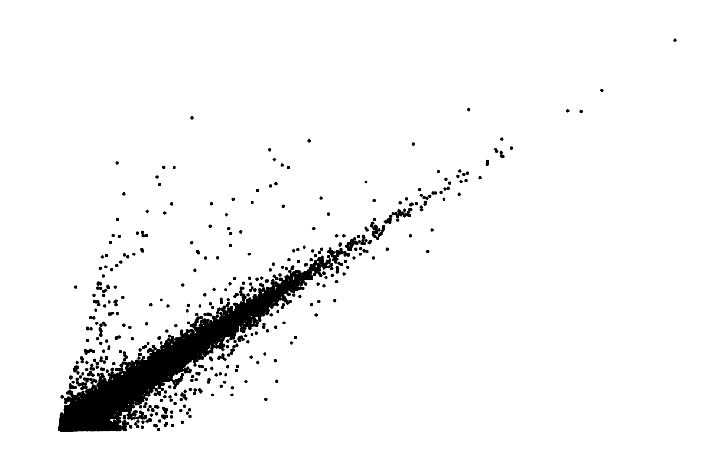
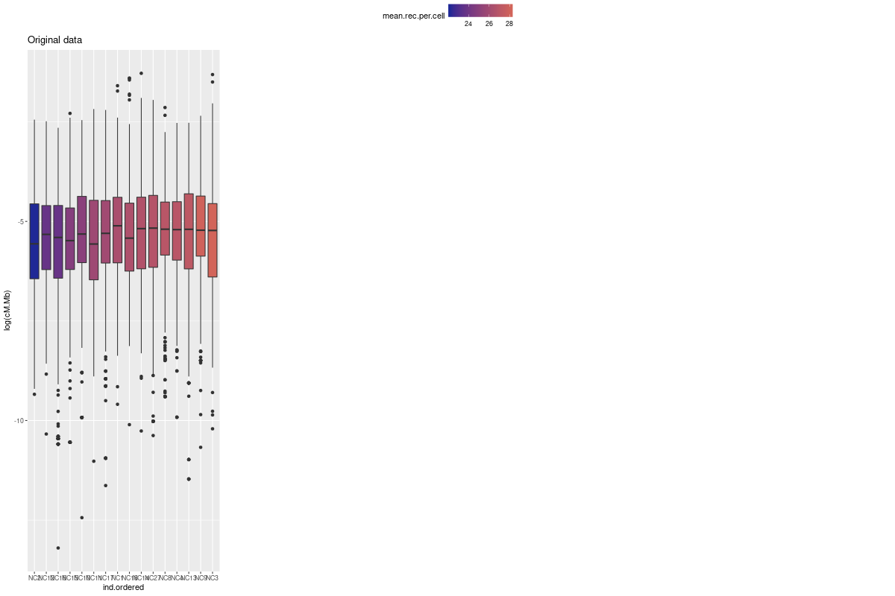
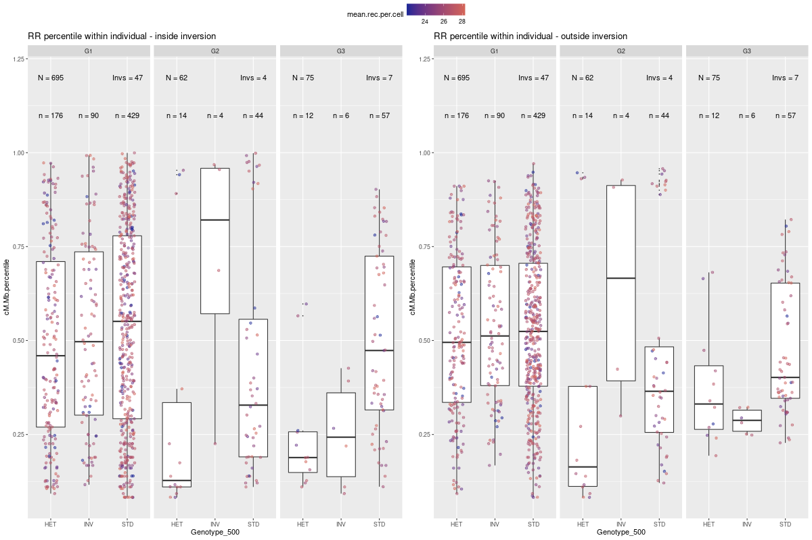
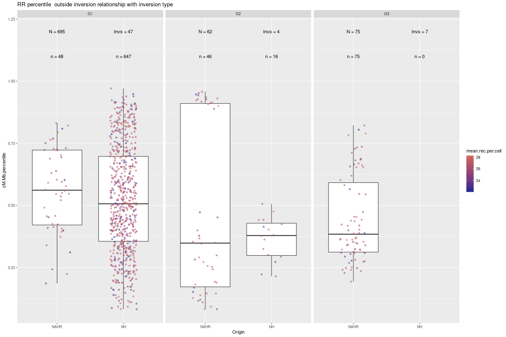
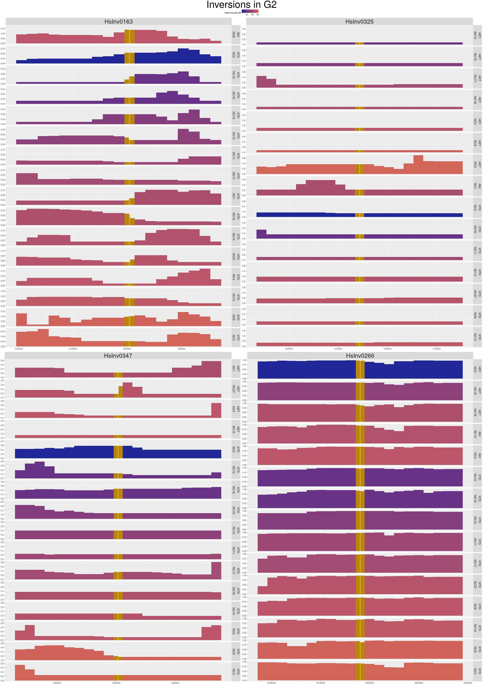
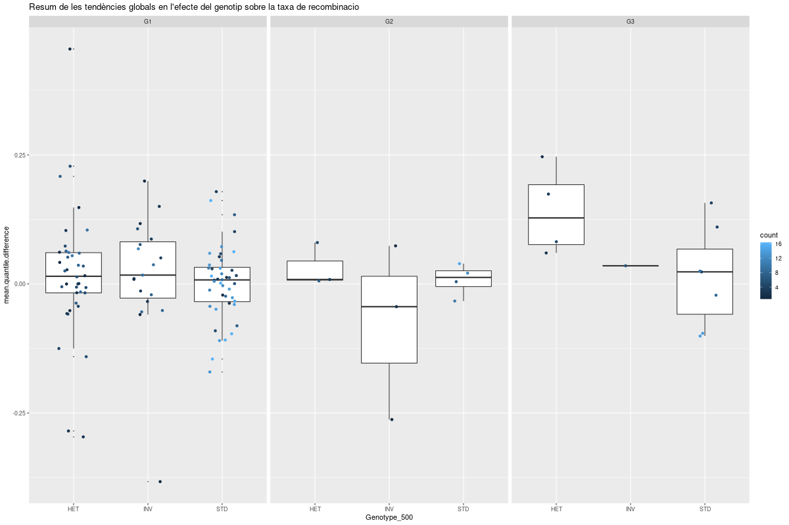

<style type="text/css">

.main-container {
  max-width: 1280px;
}

</style>

```{r, setup, include=FALSE}
require("knitr")
require("tidyr")
require("ggforce")
require("ggpubr")
require("reshape2")
library("ggplot2")
require("stringr")
# knitr::opts_knit$set(root.dir = "~/20200401_RealRecombination/")
outdir<-"report/2020-08-20_defMethods/"


```

<!-- # Imputació dels genotips -->

<!-- Per assegurar que els genotips inferits per cadascun dels individus són fiables, es tindran en compte múltiples fonts d'informació:  -->

<!-- * **Análisis previs d'imputabilitat:** el Jon va fer anteriorment anàlisis per avaluar si les inversions tenen tagSNPs, o en cas contrari, si són imputables amb fiabilitat mitjançant IMPUTE2, ja que de vegades pot retornar resultats que són de bona qualitat segons el programa, però en realitat estan errats.  -->

<!-- * **Imputació amb IMPUTE2:** en el manual del IMPUTE2 el seu creador recomana no utilitzar com a referència només els individus que pertanyin a la mateixa població que la mostra, perquè IMPUTE2 ja té una passa en què busca aquells individus de la referència que més s'assemblin als que estem genotipant. Per altra banda, algunes inversions, en especial les recurrents, podrien confondre al programa a l'hora de triar individus de referència. Es van comparar diferents combinacions per origen de la mostra (tots els individus o bé la població concreta segons la procedència de la mostra, confirmada per PCA) i quantitat d'haplotips de referència (entre 100 i 500) i això va servir per destriar aquells genotips excel·lents (uniformes entre diferents metodologies i sempre de bona qualitat) i els que no eren tan precisos.  -->

<!-- * **Densitat de SNPs i manteniment dels tag SNPs:** per tenir en compte las variacions en el _coverage_ i la possible pèrdua de tag SNPs en algunes inversions que podrien disminuir la qualitat de la imputació, es calcularà la densitat de SNPs a la regió utilitzada per l'IMPUTE2 i es comptaran quants tagSNPs van ser efectivament seqüenciats, i d'aquests, quants segueixen sent tag SNPs si acceptem els genotips inferits pel programa.  -->

<!-- * **Genotipació amb breakseq:** aquest mètode és altament fiable i en cas d'estar disponible, la resta d'anàlisis serveixen més de confirmació/reiteració del resultat o per mostrar el context de la regió en quant a la quantitat de SNPs disponibles i a com de semblant és l'haplotip de l'individu al d'altres amb la seva mateixa orientació per aquesta inversió concreta. -->

<!-- En general, es pretén ser estricte amb quins genotips es consideren prou bons com per ser inclosos en l'anàlisi estadístic. Idealment, serien aquells on s'hagi pogut fer el breakseq i coincideixi amb el resultat de la imputació, la qual hauria estat uniforme i de bona qualitat independentment dels paràmetres fets servir (a no ser que estés classificada com a no imputable, que llavors podria haver-hi discrepàncies) i que la densitat de SNPs sigui bona i els tagSNPs, si n'hi havia, s'hagin mantingut en alt desequilibri de lligament amb la inversió. En cas de no estar disponible la genotipació mitjançant breakseq, serien acceptats aquells genotips que mantinguin la resta de les condicions anteriors per a aquelles inversions que hagin estat classificades com a imputables pel Jon.  -->

<!-- # Ajustament de la resolució dels events d'entrecreuament -->

<!-- La mida mitjana dels events d'entrecreuament proporcionats per Bell et al. (2020) és de 400kb. Aquesta mida tan gran és deguda al poc _coverage_ per cèl·lula que tenen. En el seu anàlisis, ells assumeixen que els events d'entrecreuament han ocorregut al centre de la regió, i fan servir finestres de 500kb. Nosaltres necessitem més resolució, com a mínim en el cas de les inversions petites. Per fer-ho, calculem la taxa de recombinació comptant la fracció dels events que solapen amb una finestra d'una mida concreta, enlloc del seu nombre en termes absoluts. -->

<!-- Aquesta és una forma senzilla d'augmentar la resolució, tot i que en alguns casos no és possible degut a la baixa quantitat d'events detectats, que depèn de la taxa de recombinació local, o a la mida massa gran d'aquests events a causa del baix _coverage_ en aquella regió. Segons les proves que s'han anat fent, la mida mínima de finestra amb què es poden observar diferènces entre finestres colindants per moltes de les regions que ens interessen és de ~10kb, però una resolució més realista que pot funcionar per la majoria de casos deu rondar entre les 100 i les 200kb, que per altra banda és una millora respecte a les 500kb de l'article original. -->


# Test de qualitat per l'ajustament de la resolució

> En aquest apartat i en endavant, s'anomenarà "event de recombinació" als rangs proporcionats en el paper de Bell et al. 2020, que son de mitjana de 400kb de llarg, i "entrecreuament" a la posició dins de l'event de recombinació on realment hi hauria hagut l'entrecreuament

En el paper original es considera que els entrecreuaments han tingut lloc al centre dels events de recombinació. Aquesta situacio, en especial tenint en compte la mida dels events de recombinació donats, és poc realista. Per això nostraltres provarem de calcular la taxa de recombinacio en cada una de les finestres sumant el valor de les parts proporcionals dels events de recombinacio que hi solapen, de forma que es dona mes credibilitat als events de recombinacio d'alta resolucio. Aixo ens permetria, a mes, tenir mapes elaborats amb finestres mes petites sense que el valor de moltes d'aquestes finestres sigui 0 tot i que solapin amb events de recombinacio i per tant existia la possibilitat de que s'hagues efectuat un entrecreuament dins els limits de la finestra en qüestió.

<!-- Primer de tot, es carreguen els mapes fets amb diferents finestres en una sola taula que guarda tota la informació rellevant.  -->

```{r XrecMap, echo = FALSE, eval=FALSE}

## Take samples as in paper in recombination rate
setwd("~/20200401_RealRecombination/")

load("analysis/2020-08-24_09_crossovers_paperMap50/crossoverResult.Rdata")
recMap.p<-data.frame(recMap)
load("analysis/2020-08-24_09_crossovers_paperMap20/crossoverResult.Rdata")
recMap.p<-rbind(recMap.p,data.frame(recMap))
load("analysis/2020-08-24_09_crossovers_paperMap500/crossoverResult.Rdata")
recMap.p<-rbind(recMap.p,data.frame(recMap))
load("analysis/2020-08-24_09_crossovers_paperMap100/crossoverResult.Rdata")
recMap.p<-rbind(recMap.p,data.frame(recMap))

recMap.p$group<-"paper"


## Take samples by our method in recombination rate

load("analysis/2020-08-24_09_crossovers_newMap50/crossoverResult.Rdata")
recMap.n<-data.frame(recMap)
load("analysis/2020-08-24_09_crossovers_newMap20/crossoverResult.Rdata")
recMap.n<-rbind(recMap.n,data.frame(recMap))
load("analysis/2020-08-24_09_crossovers_newMap500/crossoverResult.Rdata")
recMap.n<-rbind(recMap.n,data.frame(recMap))
load("analysis/2020-08-24_09_crossovers_newMap100/crossoverResult.Rdata")
recMap.n<-rbind(recMap.n,data.frame(recMap))

recMap.n$group<-"new"


# Join all
recMap <- rbind(recMap.n, recMap.p)

# Clean
rm(recMap.n, recMap.p)

# Save
save(recMap, file = paste0(outdir,"Rdata/recMap.Rdata"))
``` 

```{r DrecMap, echo = FALSE}
 load("Rdata/recMap.Rdata")

```


Per conèixer els efectes de l'augment de la resolució sobre les estimes de recombinació i assegurar-nos que no causem esbiaixos importants, es fa uncontrol de qualitat comparant els dos metodes i tambe comparant els resultats d'agafar mides de finestra mes grans o mes petites (500kb, 100kb, 50kb i 20kb). Tot i que a nivell local podria haver-hi diferències puntuals, en termes globals la nostra metodologia hauria de donar resultats semblants a la del paper.

Per saber si el sistema de mesura està afectant al mapa de recombinació, podem comprovar si hi ha una correlació entre els mapes calculats d'una manera i l'altra (Figura 1). Els resultats mostren una correlació entre moderada i forta, estadísticament significativa, pero en els gràfics es pot veure com algunes de les taxes de recombinació més altes en el paper original són bastant inferiors amb el nostre mètode, independentment de la mida de finestra. Això és degut a que alguns d'aquests punts probablement solapen amb molts events de recombinació representats amb intervals de confiança molt grans i, per tant, la probabilitat real de que l'entrecreuament hagi tingut lloc específicament a la finestra en qüestió és menor que l'estimat simplement tenint en compte el punt central de l'event de recombinació. 

```{r XcorrelRecMapQualityTest,  echo = FALSE, eval=FALSE}

# Function makes things easier (supposedly)

function.correlRecMapQualityTest<-function(recMap.all, size){
  
  my_data<-(recMap.all[recMap.all$winsize==size,])
  my_data_wide<-reshape2::dcast(my_data, ind+chr_w+start_w ~ group , value.var = "cM.Mb" )
  a<-annotate_figure(
    ggscatter(my_data_wide, x = "new", y = "paper",
          add = "reg.line", conf.int = TRUE,
          cor.coef = TRUE, cor.method = "pearson",
          xlab = "Values in our method", ylab = "Values in paper",cor.coef.size = 15),
  top = text_grob(paste0("Correlation between recombination map calculation systems (",size/1000,"kb)"), size = 30) )
  
  plotname<-paste0(outdir, "images/correlRecMapQualityTest_",size/1000,".png")
  png(filename=plotname, width = 1200, height =800, units = "px" )
  print(a)
  dev.off()
  
}

for (round in c(500000,100000 ,50000,20000)) {
  function.correlRecMapQualityTest(recMap, round)
}

  
  
```

{ width=45% } { width=45% }
{ width=45% } { width=45% }

**Figura 1. Correlacio entre mapes de recombinacio calculats amb diferents metodologies.** _Per comprovar l'efecte del sistema de mesura, s'ha calculat la correlacio entre les taxes de recombinacio del mapa calculat com el paper i del mapa calculat mitjançant el metode nou, per mides de finestra de a)500kb, b)100kb, c)50kb, d)20kb. _

Aquest efecte a nivell local sobre les taxes de recombinació és esperable i desitjable, ja que el que vol dir que les nostres mesures estan modulant falsos pics alhora que augmenta la resolució del mapa. En cas que realment estigui funcionant correctament, aquesta modulació local no afectarà a la mitjana de les finestres, és a dir, que el valor de les finestres de 500kb hauria de ser molt semblant a la mitjana de les finestres de 100, 50 o 20 kb que hi solapen. Tal com es pot veure a la Figura 2, això s'acompleix, i hi ha una correlació perfecta entre les mitjanes d'una opció i els valors de l'altra, per tant, podem concloure que alterar la mida de finestre per augmentar la resolucio no introdueix esbiaixos importants.

```{r XmeansRecMapQualityTest,  echo = FALSE, eval=FALSE}

function.meansRecMapQualityTest<-function(size.small, size.large, recMap){
  
  # Make two tables
  tmp.small<-recMap[recMap$winsize %in% c(size.small) & recMap$group == "new" & recMap$ind =="NC1" ,c("start_w", "chr_w","winsize", "cM.Mb", "ind" )]
  tmp.large<-recMap[recMap$winsize %in% c(size.large) & recMap$group == "new" & recMap$ind =="NC1" ,c("start_w", "chr_w","winsize", "cM.Mb", "ind" )]
  
  # Make number vectors
  numbers<-unique(tmp.small$start_w)
  categories<-sort(unique(tmp.large$start_w))
  
  # Classify one set into another
  classification<-data.frame(cbind(numbers,categories[findInterval(numbers,categories)]))
  colnames(classification)<-c("start_w", "category")
  tmp.small.classified<-merge(tmp.small, classification, all.x = TRUE)
    
  # Aggregate according to classification
  tmp.small.aggregated<-aggregate(cM.Mb  ~ ind+chr_w+category, tmp.small.classified, mean )
  
  # Merge control and sample tables
  colnames(tmp.large)<-c("category", "chr_w", "winsize", "cM.Mb.control", "ind")
  tmp.merged<-merge(tmp.small.aggregated, tmp.large, by=c("category", "chr_w", "ind"))
  
  # Create plot
  a<-annotate_figure( 
  ggscatter(tmp.merged, x = "cM.Mb.control", y = "cM.Mb",
            add = "reg.line", conf.int = TRUE,
            cor.coef = TRUE, cor.method = "pearson",
            cor.coef.size = 15,
            xlab = paste0("Values with ",size.large/1000,"kb windows"), ylab =  paste0("Corresponding mean values with ",size.small/1000,"kb windows")),
  top = text_grob(paste0("Correlation between recombination map window sizes (",size.large/1000," and ",size.small/1000,"kb)"), size = 30))
  
    plotname<-paste0(outdir, "images/meansRecMapQualityTest_",size.small/1000,".to.",size.large/1000,".png")
    png(filename=plotname, width = 1200, height =800, units = "px" )
    print(a)
    dev.off()
  }

function.meansRecMapQualityTest(20000, 500000, recMap)
function.meansRecMapQualityTest(50000, 500000, recMap)
function.meansRecMapQualityTest(100000, 500000, recMap)

```

{ width=45% }{ width=45% }{ width=45% }

**Figura 2. Correlacio entre mapes de recombinacio calculats a partir de diferents mides de finestra.** _Per comprovar l'efecte del sistema de mesura,2s'ha calculat la correlacio entre els diferents mapes calculats mitjançant el metode nou. Per cada finestra de 500kb, s'ha calculat la taxa de recombinacio mitjana de les finestres de a)100kb, b)50kb, c)20kb que hi solapen._

# Mostreig de les dades de recombinació

Les inversions s'han dividit en 3 grups diferents en funció de la seva mida per analitzar-les amb paràmetres més adients. Es considerarien inversions petites aquelles menors de 5kb, mitjanes aquelles entre 5 i 50kb i grans aquelles majors de 50kb. La mida final dels grups dependrà de quantes de les inversions tenen genotips de prou qualitat com per ser analitzades i de la possibilitat d'adaptar la resolució del mapa de recombinació a la mida de finestra establerta per cada grup.

De forma general, la regió al voltant de la inversió es va dividir en "in" (zona interna de la inversió, que exclou els breakpoints), "buffer" (zona immediatament colindant a la inversió, que inclou l'interval de confiança dels breakpoints o bé els inverted repeats, el que sigui més gran, que serà d'una mida mínima de 20kb a banda i banda), i "out" (finestres de mida fixa més enllà del buffer). La mida de la regió "out" a banda i banda seria de 250kb per les inversions petites, 500kb per les mitjanes i 1Mb per les grans, dividides en finestres de 50kb. 

```{r XrecRate,  echo = FALSE, eval=FALSE}

# LOAD INFO
load("analysis/2020-08-25_09_crossovers_invsG1a/crossoverResult.Rdata")
recMap.G1a<-data.frame(recMap, group="G1")
load("analysis/2020-08-25_09_crossovers_invsG2a/crossoverResult.Rdata")
recMap.G2a<-data.frame(recMap, group="G2")
load("analysis/2020-08-25_09_crossovers_invsG3a/crossoverResult.Rdata")
recMap.G3a<-data.frame(recMap, group="G3")

recRate.allwins<-rbind(recMap.G1a, rbind(recMap.G2a, recMap.G3a))
rm(recMap.G1a, recMap.G2a, recMap.G3a)

load("analysis/2020-08-25_09_crossovers_invsG1o/crossoverResult.Rdata")
recMap.G1o<-data.frame(recMap, group="G1")
load("analysis/2020-08-25_09_crossovers_invsG2o/crossoverResult.Rdata")
recMap.G2o<-data.frame(recMap, group="G2")
load("analysis/2020-08-25_09_crossovers_invsG3o/crossoverResult.Rdata")
recMap.G3o<-data.frame(recMap, group="G3")

recMap.outwins<-rbind(recMap.G1o, rbind(recMap.G2o, recMap.G3o))
recRate.outwins<-cbind( recMap.outwins, stringr::str_split_fixed(string = recMap.outwins$inv, pattern = "_", n = 2 ))
colnames(recRate.outwins)[12:13]<-c("invID", "winID")
rm(recMap.G1o, recMap.G2o, recMap.G3o)


# EXTRA IFO (for common use through the different analyses)

# Individual colors (mean crossovers per cell)
  crossoverbed<-read.table("report/2020-05-29_crossoverSummary/allcrossovers.bed", header=TRUE)
  counts<-data.frame(stringr::str_split_fixed(crossoverbed$donor_cell, "_", 2))
  counts$counter<-1
  
  counts.sum<-aggregate(counter ~ X1+X2, data=counts, FUN=sum)
  counts.mean<-aggregate(counter ~ X1, data=counts.sum, FUN=mean)
  
  colnames(counts.mean)<-c("ind", "mean.rec.per.cell")
  
  recRate.outwins<-merge(recRate.outwins, counts.mean)
  
  rm(list = ls(pattern = "counts.*"))
  rm(crossoverbed)

# Individual orders for colors
   recRate.outwins$ind.ordered <- reorder(as.factor(recRate.outwins$ind), recRate.outwins$mean.rec.per.cell)

# CALDRIA TENIR UNA TAULA AMB ELS GENOTIPS BEN BEN DEFINITIUS
   
 # Individual genotypes
   # Get individuals genotypes
    genotypes<-read.table("analysis/2020-05-23_07_imputationTables/imputationResults.csv", header=TRUE, sep = ",")
  
    # Get individual names
    genotypes$Individual<-sub("^\\d+\\.","",genotypes$Individual)
    genotypes$Individual<-sub("nc", "NC", genotypes$Individual, ignore.case = FALSE)
  
    # Merge with info
    recRate.outwins<-  merge(recRate.outwins, genotypes[,c("Individual", "Inversion", "Genotype_500")], by.x = c("ind", "invID") , by.y = c("Individual", "Inversion" ))
    
    # Clean up
    rm(genotypes)

# Inversions info
  invinfo<-read.table("data/use/inversions_info/2020-08_inversionInfo_hg38.csv", sep = "\t", header = TRUE)
  invinfo$Size<-as.numeric(gsub("," , "", invinfo$Size))
  recRate.outwins<-merge(recRate.outwins, invinfo, by.x="invID", by.y = "Inversion")
   
  rm(invinfo)

# SAVE TABLES

save(recRate.outwins, recRate.allwins, file = paste0(outdir,"Rdata/recRate.Rdata"))

```

```{r DrecRate, echo = FALSE}
 load("Rdata/recRate.Rdata")

```


## Filtratge del mostreig

En principi, es descartarien aquelles mostres on s'observi que no hi ha canvis al llarg de tota la regió analitzada per una inversió i individu concrets. Això sol venir causat per una baixa resolució de les mesures de recombinació locals, és a dir, que tots els events que solapen amb tota la regió de la inversió són més grans que aquesta.

Falta per contrastar aquests resultats amb dades de coverage local, ja que s'espera que menys SNPs donin lloc a events de recombinació de mida més gran i per tant menys possibilitats de millorar la resolució amb el nostre mètode de càlcul de taxes de recombinació.

Les dades de coverage local també serien útils a l'hora de diferenciar si en una regió no s'han detectat events de recombinació per falta de coverage o per una taxa de recombinació realment baixa. 

Aquest seria el nombre de dades (cada una representant una inversio en un individu concret) que es perdrien en cas d'aplicar els filtres. De moment les proves i els anàlisis s'han fet amb totes les dades, a l'espera de decidir que fem en cada cas.

**Taula 1. Filtratge de dades.** _Cada columna és un grup d'inversions segons la seva mida: G1 fins a 5kb, G2 de 5 a 50kb i G3 més de 50kb. La fila Excluded es aquella on totes les finestres per una inversio en un individu concret tenen exactament la mateixa taxa de recombinacio i per tant no podem diferenciar entre diferents regions. Aixo afectaria nomes a aquells analisis on es comparin diferents tipus de finestra dins de la mateixa inversio. La fila Recombination Rate 0 (RR0) es aquella on la taxa de recombinacio ha estat 0 en totes les finestres associades a la inversio i els seus voltants. El total es la suma de les dues files._

```{r DfilterInvs,  echo = FALSE}
# Summarize score in all the inversion region with mean and variance
  tmp.agg.variance<-aggregate(score ~ ind+inv+group, data = recRate.allwins, FUN = var )
  colnames(tmp.agg.variance)<-c("ind", "inv", "group", "variance")
  tmp.agg.mean<-aggregate(score ~ ind+inv, data = recRate.allwins, FUN = mean )
  tmp.summary<-merge(tmp.agg.variance, tmp.agg.mean)

  # Make statistics to show how many data will be lost
  matrix(
  c(table(tmp.summary[tmp.summary$variance == 0 &tmp.summary$score !=0,"group"]),
  table(tmp.summary[tmp.summary$variance == 0 &tmp.summary$score ==0,"group"]),
  table(tmp.summary[tmp.summary$variance == 0 ,"group"]) ),
  byrow = TRUE,  nrow = 3, ncol = 3, dimnames=list(c("Excluded", "RR0", "Total"), c("G1", "G2", "G3")))

# Remove temporary objects
  rm(list = ls(pattern = "tmp.*"))
  
```

## Normalització del mostreig

Per poder comparar entre idividus i inversions, es va dir de normalitzar les taxes de recombinacio en funcio de l'individu i/o el cromosoma, en funcio del que es volgues fer. 

He fet servir el mapa de recombinació elaborat amb el nostre metode i amb finestres de 500kb com a referència per calcular les mitjanes que necessitem, ja que es la opcio computacionalment menys pesada i com ja hem demostrat abans, la mitjana sortiria la mateixa independentment de la mida de finestra triada per aquesta tasca.

A primera vista (Figura 3) no es noten diferencies apreciables quan s'aplica un o altre metode de normalitzacio, pero observant atentament la comaparativa nomes amb un subset de les dades (Figura 4) es pot veure com s'introdueixen petits canvis.


```{r XnormInvs,  echo = FALSE, eval = FALSE}
# Generate normalization values
  ind.normalization<-aggregate(cM.Mb ~ ind , recMap[recMap$winsize==500000 & recMap$group == "new",], mean)
  colnames(ind.normalization)<-c("ind", "meanIndRecRate")
  chr.normalization<-aggregate(cM.Mb ~ chr_w+ind, recMap[recMap$winsize==500000 & recMap$group == "new",], mean)
  colnames(chr.normalization)<-c("chr_w", "ind", "meanChrRecRate")

# Normalize dataset
  recRate.outwins<-merge(recRate.outwins, ind.normalization)
  recRate.outwins<-merge(recRate.outwins, chr.normalization)

  recRate.outwins$cM.Mb.ind.norm<-recRate.outwins$cM.Mb / recRate.outwins$meanIndRecRate
  recRate.outwins$cM.Mb.chr.norm<-recRate.outwins$cM.Mb / recRate.outwins$meanChrRecRate
  recRate.outwins$cM.Mb.cel.norm<-recRate.outwins$cM.Mb / recRate.outwins$mean.rec.per.cell
  
# ALL DATA
# Compare normalizations
  a<-ggplot(recRate.outwins)+geom_boxplot(aes(x = ind.ordered, y =log(cM.Mb), fill = mean.rec.per.cell))+
  scale_fill_gradient(low = "#1f2896", high = "#d26459")+ggtitle("Original data")
  b<-ggplot(recRate.outwins)+geom_boxplot(aes(x = ind.ordered, y =log(cM.Mb.ind.norm), fill = mean.rec.per.cell))+
  scale_fill_gradient(low = "#1f2896", high = "#d26459")+ggtitle("Mean individual RR normalization")
  c<-ggplot(recRate.outwins)+geom_boxplot(aes(x = ind.ordered, y =log(cM.Mb.chr.norm), fill = mean.rec.per.cell))+
  scale_fill_gradient(low = "#1f2896", high = "#d26459")+ggtitle("Mean chromosome RR normalization")
  d<-ggplot(recRate.outwins)+geom_boxplot(aes(x = ind.ordered, y =log(cM.Mb.cel.norm), fill = mean.rec.per.cell))+
  scale_fill_gradient(low = "#1f2896", high = "#d26459")+ggtitle("Mean RR/cell normalization")

  plotname<-paste0(outdir, "images/normInvs_alldata.png")
  png(filename=plotname, width = 1200, height =800, units = "px" )
  ggpubr::ggarrange(a,b,c,d, common.legend =  TRUE, nrow=1 )
  dev.off()
  
# Clean
  rm(a,b,c,d)

# DATA SUBSET
  # Make subset
  tmp.sample<-recRate.outwins[recRate.outwins$cM.Mb %in% quantile(recRate.outwins$cM.Mb, seq(0.0005,1,length.out = 100)),]
  tmp.sample<-tmp.sample[!duplicated(tmp.sample$cM.Mb),]
  
  tmp.sample<-melt(tmp.sample[,c("cM.Mb", "cM.Mb.chr.norm", "cM.Mb.ind.norm", "cM.Mb.cel.norm", "meanIndRecRate", "ind", "chr_w", "start_w")], id.vars = c("meanIndRecRate" ,"ind", "chr_w", "start_w"))
  tmp.sample$id<-paste0(tmp.sample$ind, tmp.sample$chr_w, tmp.sample$start_w)
  
  # Compare normalizations
  plotname<-paste0(outdir, "images/normInvs_sample.png")
  png(filename=plotname, width = 1200, height =800, units = "px" )
  ggplot(tmp.sample)+geom_line(aes(x = variable, y = log(value), color = mean.rec.per.cell, group = id ))+
  scale_color_gradient(low = "#1f2896", high = "#d26459")+ggtitle("Comparison of different normalization methods - subset")
  dev.off()
  
  rm(a, plotname, tmp.sample)
  
# Save for display
  save(recRate.outwins, chr.normalization, ind.normalization, file = paste0(outdir,"Rdata/normInds.Rdata"))

```


**Figura 3. Efecte de diferents normalitzacions sobre les dades. ** _Cada boxplot representa la distribucio de les taxes de recombinació al llarg del genoma per un sol individu. Els individus estan endreçants i colorejats segons el seu nivell de recombinacio global, calculat com la mitjana d'entrecreuaments per cel·lula. Depenent de la mesura que es faci servir, el eix de les y (mostrat aqui en escala logarítmica en base 10) canvia, pero la distribució de les dades es la mateixa. _


**Figura 4. Efecte de diferents normalitzacions sobre les dades en una petita mostra. ** _Cada linia representa l'evolucio d'una mateixa mesura de taxa de recombinacio per un individu i una finestra concrets. L'eix de les y esta en escala logaritmica en base 10 i el color de la linia indica la taxa de recombinacio mitjana d'aquell individu. Els valors son, d'esquerra a dreta, mesura original, mesura corregida per la taxa de recombinació mitjana del cromosoma concret, mesura corregida per la taxa de recombinació mitjana de l'individu i mesura corregida pels entrecreuaments mitjans per cel·lula en cada individu. Els canvis de la primera a la segona mesura, i de la segona a la tercera indica que la normalitzacio, tot i que subtilment, corregeix alguns esbiaixos. De la tercera a la quarta mesura les linies son paraleles perque la normalitzacio esta corregin en els dos casos per la taxa de recombinacio de l'individu. _

En general, els canvis observats son molts subtils. Aixo pot ser degut a la gran similitud que hi ha entre els diferents valors que s'estan fent per corregir, tal com es veu en els seguents resums:

```{r DnormInvs}
  
load("Rdata/normInds.Rdata")

# Summary mean recombination events per cell
summary(unique(recRate.outwins$mean.rec.per.cell))

# Summary mean chromosomal recombination rates for each chromosome and individual
summary(chr.normalization$meanChrRecRate)

# Summary mean recombination rates for each individual
summary(ind.normalization$meanIndRecRate)


```

Finalment, de fet, aquestes normalitzacions en concret no s'han fet servir, sino que s'ha optat per calcular quin percentil ocupa cada mesura dins de la distribució de dades per la que es vulgui corregir. 


# Anàlisi estadístic

```{r Dstats, echo = FALSE}

# Make measurement: how extreme is my value?
function.stats.percentiles<-function(column, grouping, recRate.outwins, reftable){
  groups<-unique(recRate.outwins[,grouping])
  recRate.outwins[,paste0(column,".percentile")]<-NA
  for (g in groups){
    tmp.percentile<-ecdf(reftable[reftable[,grouping] == g,column])
    recRate.outwins[recRate.outwins[,grouping] == g , paste0(column,".percentile")] <-
      tmp.percentile(recRate.outwins[recRate.outwins[,grouping] == g,column])
  }
  return(recRate.outwins)
}

# we want to use 20000 window size from all genome as a reference to really know how extreme things can be
recRate.outwins<-function.stats.percentiles("cM.Mb", "ind", recRate.outwins , recMap[recMap$group == "new" & recMap$winsize == 20000, ])


```

En aquesta prova hiha 64 inversions i 16 individus. La mesura que s'esta comparant es el percentil que ocupa la taxa de recombinacio en una finestra concreta dins del context del mapa de recombinacio general del seu individu corresponent. Aixo estaria per tant corregint per individu. 

## Resum general

  _Fent servir la regio de dins: Figura 5a_
  1. A primera vista, dins d'una inversió hi pot haver qualsevol taxa de recombinació en relació amb el genoma.
  2. Dit això, sembla que les inversions del grup 3 tenen taxes mes baixes en general, arribant com a maxim al ~90% major. Aixo es probable que sigui mes aviat un efecte de la mida de la finestra, al ser una mitjana d'una zona mes gran, es suavitza l'efecte. Una altra opcio es que realment hi hagi una mida a partir de la qual les taxes baixen, ja uqe hi ha una especie de clusteritzacio en les inversions del G2. 
  3. Una tendencia que sembla bastant generalitzada es que els heterozigots recombinen menys que els estandard. Podria ser que els invertits tinguin una taxa intermitja, pero no hi ha dades suficients de invertits en G2 i G3 com per afirmar que aixo passa, i de fet en aquests grups el nombre de inversions que finalment hem pogut analitzar es bastant justet. 
  
```{r XplotPercentilein, echo = FALSE, eval = FALSE}
# Now, how does this change depending on genotype?

# number of data points
ngen<-data.frame(table(recRate.outwins[recRate.outwins$winID == "in","group"]))
colnames(ngen)<-c("group" , "Freq")
ninv<-data.frame(table(recRate.outwins[recRate.outwins$winID == "in",c("group", "invID")]))
ninv<-ninv[ninv$Freq >0,]
ninv$count<-1
ninv<-aggregate( count ~ group, ninv, sum)
ngroup<-data.frame(table(recRate.outwins[recRate.outwins$winID == "in",c("group", "Genotype_500")]))
ngroup<-ngroup[ngroup$Genotype_500 != "?",]

# plot
a<-ggplot(recRate.outwins[recRate.outwins$winID == "in",], aes(x = Genotype_500,  y = cM.Mb.percentile))+geom_boxplot(outlier.size = 0)+
  scale_color_gradient(low = "#1f2896", high = "#d26459")+
  geom_point(aes(color = mean.rec.per.cell), position =position_jitter(width=0.2), alpha = 0.5)+
  geom_text(data=ngen, aes(x = "HET", y = 1.2, label = paste("N =",Freq)))+
  geom_text(data=ninv, aes(x = "STD", y = 1.2, label = paste("Invs =",count)))+
  geom_text(data=ngroup, aes(x = Genotype_500, y = 1.1, label = paste("n =",Freq)))+
  facet_grid(.~group, scales = "free")+ggtitle("RR percentile within individual - inside inversion")


```

  _Fent servir la regio de fora: Figura 5b_
  1- Sembla que aqui les taxes de recombinacio no arriben a valors tan extrems com en el cas anterior, segurament perque aqui cada punt es la mitjana de totes les finestres de la regio de fora (5, 10 i 20 finestres de 50kb pels grups G1, G2 i G3 respectivament). 
  2- Les tendencies que es veuen en comparar entre diferents genotips sembla que son les mateixes que fent servir la regio de dins, pero mes moderades. 
  3- A la regio de fora sembla haver-hi una petita tendencia a presentar valors de recombinacio majors que a la regio de dins.

```{r XplotPercentileout, echo = FALSE, eval = FALSE}

recRate.out.aggregated<-aggregate(cM.Mb.percentile  ~ group+ind+Origin+invID+Genotype_500+Size+mean.rec.per.cell, recRate.outwins[recRate.outwins$winID %in% c("left", "right"),], mean)


# number of data points
ngen<-data.frame(table(recRate.out.aggregated$group))
colnames(ngen)<-c("group" , "Freq")
ninv<-data.frame(table(recRate.out.aggregated[,c("group", "invID")]))
ninv<-ninv[ninv$Freq >0,]
ninv$count<-1
ninv<-aggregate( count ~ group, ninv, sum)
ngroup<-data.frame(table(recRate.out.aggregated[,c("group", "Genotype_500")]))
ngroup<-ngroup[ngroup$Genotype_500 != "?",]


b<-ggplot(recRate.out.aggregated, aes(x = Genotype_500,  y = cM.Mb.percentile))+geom_boxplot(outlier.size = 0)+
  scale_color_gradient(low = "#1f2896", high = "#d26459")+
  geom_point(aes(color = mean.rec.per.cell), position =position_jitter(width=0.2), alpha = 0.5)+
  geom_text(data=ngen, aes(x = "HET", y = 1.2, label = paste("N =",Freq)))+
  geom_text(data=ninv, aes(x = "STD", y = 1.2, label = paste("Invs =",count)))+
  geom_text(data=ngroup, aes(x = Genotype_500, y = 1.1, label = paste("n =",Freq)))+
  facet_grid(.~group, scales = "free")+ggtitle("RR percentile within individual - outside inversion")


  plotname<-paste0(outdir, paste0("images/plotPercentile.png"))
  png(filename=plotname, height = 800, width =1200, units = "px" )
  
  plot<-ggarrange(a,b,common.legend = TRUE)
  print(plot)
  dev.off()
  
  # Save data
  
  save(recRate.out.aggregated, file=paste0(outdir, "Rdata/Percentileout.Rdata"))
```



**Figura 5. Distribucio general de les taxes de recombinacio dins i fora de la inversio.** _Les dades dins de la inversio s'han obtingut del valor de la finestra "in" per cada inversio. Les dades de fora de la inversio son la mitjana del resultat de les diferents finestres "out" de cada inversio. Cada punt representa el percentil que ocupa la taxa de recombinació per una inversio i individu concret en la regio especificada en la distribucio del mapa de recombinacio de l'individu. S'han agrupat les dades per mida de inversio (grups 1, 2, i 3) i per genotip de l'individu en qüestio. Cada punt esta colorejat segons la taxa de recombinacio mitjana d'aquell individu. _

## Relacio amb la mida de la inversio

S'ha fet una bateria de tests per mirar el valor de la correlacio i el seu p-value entre la mitjana dels percentils per les finestres fora de la inversio i la mida de la inversio. Fent servir les finestres de fora s'espera poder comparar, en el context del genoma d'un individu, si les inversions apareixen en regions de mes alta o baixa recombinacio. 

El grup 2 presenta una forta correlacio negativa amb p-values significatius, pero estem parlant de nomes 4 inversions. Hi ha una correlacio moderada i sembla que significativa per les inversions grans quan es miren els individus heterozigots explusivament, peor altre cop aquest es un dels grups amb menys dades. Al mirar el panorama general no hi ha res remarcable, crec. 

```{r DbatteryCorrel, echo = FALSE}
load("Rdata/Percentileout.Rdata")

function.BatteryCorrel<-function(test.table,variable){
  genotypes<-c("STD", "INV", "HOMO", "HET", "ALL")
  groups<-c("G1", "G2", "G3", "ALL")
  correl<-matrix(,nrow=5, ncol=4, dimnames = list(genotypes,groups ))
  pval<-matrix(,nrow=5, ncol=4, dimnames = list(genotypes,groups ))
  
  for (geno in genotypes) {
    
    if (geno == "HOMO") {
      ge<-c("INV", "STD")
    }else if (geno == "ALL") {
      ge<-c("INV", "STD", "HET")
    } else {
      ge<-geno
    }
    
    for (gru in groups){
    
        if(gru == "ALL"){
          gr <-c("G1", "G2", "G3")
        } else {
          gr<-gru
        }
        
        data<-test.table[test.table$Genotype_500 %in% ge & test.table$group %in% gr, c("Size", variable) ]
        test<-cor.test(data$Size, data[,variable], method="pearson")
      
        correl[geno, gru]<-test$estimate
        pval[geno, gru]<-test$p.value
      
    }
  }

  return(list(correl=correl, pval=pval))
  
}

function.BatteryCorrel(recRate.out.aggregated, "cM.Mb.percentile")

```

## Relacio amb el tipus d'inversio

Aqu s'ha representat les mateixes dades que en els tests anteriors pero separant segons el mecanisme de generacio, per veure si el fet que siguin generades per NH o NAHR afecta en la taxa de recombinacio en la que apareix una inversio. 

Sembla que en general les inversions mediades per NH apareixen en llocs de recombinació més baixa que les mediades per NAHR, que es esperable, ja que en altres articles es menciona un augment de les variants estructurals generades per NAHR en zones properes a hotspots. Tot i aixi, no sembla que hi hagi prou dades com per treure alguna cosa en clar respecte a inversions mitjanes i grans, perque nomes hi ha una inversio de tipus NH en cada grup. 

```{r XinvTypeRel, echo=FALSE, eval=FALSE}

# number of data points
ngen<-data.frame(table(recRate.out.aggregated$group))
colnames(ngen)<-c("group" , "Freq")
ninv<-data.frame(table(recRate.out.aggregated[,c("group", "invID")]))
ninv<-ninv[ninv$Freq >0,]
ninv$count<-1
ninv<-aggregate( count ~ group, ninv, sum)
ngroup<-data.frame(table(recRate.out.aggregated[,c("group", "Origin")]))

  plotname<-paste0(outdir, paste0("images/invTypeRel.png"))
  png(filename=plotname, height = 800, width =1200, units = "px" )
  ggplot(recRate.out.aggregated, aes(x = Origin,  y = cM.Mb.percentile))+geom_boxplot(outlier.size = 0)+
  scale_color_gradient(low = "#1f2896", high = "#d26459")+
  geom_point(aes(color = mean.rec.per.cell), position =position_jitter(width=0.2), alpha = 0.5)+
  geom_text(data=ngen, aes(x = "NAHR", y = 1.2, label = paste("N =",Freq)))+
  geom_text(data=ninv, aes(x = "NH", y = 1.2, label = paste("Invs =",count)))+
  geom_text(data=ngroup, aes(x = Origin, y = 1.1, label = paste("n =",Freq)))+
  facet_grid(.~group, scales = "free")+ggtitle("RR percentile  outside inversion relationship with inversion type")

  dev.off()

```



**Figura 6. Taxes de recombinacio fora de la inversio en funció del mencanisme de generació.** _Les dades son la mitjana del resultat de les diferents finestres "out" de cada inversio per un individu determinat. Cada punt representa el percentil que ocupa la taxa de recombinació per una inversio i individu concret en la regio especificada en la distribucio del mapa de recombinacio de l'individu. S'han agrupat les dades pel mecanisme de generació i pel genotip de l'individu per la inversió en qüestio. Cada punt esta colorejat segons la taxa de recombinacio mitjana d'aquell individu. _

## Efecte del genotip sobre la taxa de recombinació, inversió a inversió

Én la Figura 7 es pot veure el context de les inversions del grup 2 i 3. 

```{r DInvPlot, echo = FALSE, eval = FALSE}

function.InvPlot<-function(inversion, recRate.outwins){

    test.subset<-recRate.outwins[recRate.outwins$invID == inversion,]

    a<-ggplot(test.subset)+geom_rect(aes(xmin=start_w, xmax=end_w, ymin = 0, ymax = cM.Mb.percentile, fill = mean.rec.per.cell))+
      scale_fill_gradient(low = "#1f2896", high = "#d26459")+
      geom_rect(data = test.subset[test.subset$winID=="in",], aes(xmin=start_w, xmax=end_w, ymin = 0, ymax = cM.Mb.percentile), fill="goldenrod")+
      geom_rect(data = test.subset[test.subset$winID%in% c("br", "bl"),], aes(xmin=start_w, xmax=end_w, ymin = 0, ymax = cM.Mb.percentile), fill="darkgoldenrod")+
      facet_grid(Genotype_500+ind.ordered~invID)+
      theme(strip.text.y = element_text(size = 15),strip.text.x = element_text(size = 30), axis.text.y = element_text(size= 10))
    return(a)
}


for (g in c("G2", "G3")){
  
  plotlist<-list()
  for(i in unique(recRate.outwins[recRate.outwins$group == g, "invID"])){
   plotlist[[i]]<-function.InvPlot(i, recRate.outwins )
  }

  plotname<-paste0(outdir, paste0("images/invDescription_",g,".png"))
  png(filename=plotname, height = 3508, width =2480, units = "px" )
  plot<- annotate_figure( ggarrange(plotlist=plotlist, common.legend = TRUE), top = text_grob(paste0("Inversions in ", g ), size = 50) )
  print(plot)
  dev.off()
  
}

```




**Figura 7. Inversions del grup 2 en context.** _Les inversions del grup 2 son d'entre 5 i 50kb. La zona interna de la inversió (finestra "in") està represenada en groc. A banda i banda, en groc fosc, estan les finestres "buffer", que inclouen els breakpoints i inverted repeats coneguts per les inversions, i per les que s'ha fixat una mida mnia de 20kb. La resta de finestres son les finestres "out". Per a cada inversio hi ha 10 finestres "out" de 50kb. Les finestes "out" estan colorejades segons la taxa de recombinacio mitjana de l'individu, i per cada inversio els individus estan endreçats per genotip i taxa de recombinació mitjana. _


**Figura 8. Inversions del grup 3 en context.** _Les inversions del grup 3 son de mes de 50kb. La zona interna de la inversió (finestra "in") està represenada en groc. A banda i banda, en groc fosc, estan les finestres "buffer", que inclouen els breakpoints i inverted repeats coneguts per les inversions, i per les que s'ha fixat una mida mnia de 20kb. La resta de finestres son les finestres "out". Per a cada inversio hi ha 20 finestres "out" de 50kb. Les finestes "out" estan colorejades segons la taxa de recombinacio mitjana de l'individu, i per cada inversio els individus estan endreçats per genotip i taxa de recombinació mitjana. _

Agafem la diferencia entre la mitjana de fora i el valor de dins. Al ser quantils em donen informacio del % de distancia entre ells. Hauria de ser una mesura comparable entre individus. En la Figura 9, s'agrupen en diferents boxplots aquestes diferències. S'ha restat el valor de dins al de fora, per tant un 0 vol dir que ambdues mesures son iguals. Valors positius volen dir que les mesures dins de la inversio son menors que la mitjana de fora. Valors negatius, al reves, dins hi ha mes recombinacio que fora. 

Com a recordatori, hi a 9 inversions del grup 3, 4 del grup 2 i 51 del grup 1, pero no totes elles tenen informacio de tots els genotips. En general, les mesures dels grups 1 i 2 mostren que no hi ha practicament diferencia entre dins i fora de la inversio. En les inversions grans, es veu que els individus estandard tenen valors lleugerament mes alts a fora que a dins, pero que aquestes diferències s'accentuen en els individus heterozigots, tot i que la mida de mostra sol ser mes grans per estandards que invertits dins de cada una de les inversions. 

La majoria d'inversions del grup 1 son generades per NH, mentre que la majoria dels grups 2 i 3 son generades per NAHR, i les 3 generades per NH que hi ha entre els dos grups només aporten dades a un dels 3 genotips possibles.  

```{r DquantileDifference, echo = FALSE, eval = FALSE}

idlist<-c("group", "ind", "invID", "Genotype_500")
recRate.comparison.inout<-merge(recRate.outwins[recRate.outwins$winID =="in",c("cM.Mb.percentile",idlist)], recRate.out.aggregated[, c("cM.Mb.percentile", idlist)] , by =idlist )

# Fuera (grande) - dentro (pequeño)
recRate.comparison.inout$quantile.difference<-recRate.comparison.inout$cM.Mb.percentile.y-recRate.comparison.inout$cM.Mb.percentile.x

recRate.comparison.inout$count<-1

recRate.comparison.inout.agg<-aggregate(quantile.difference  ~ group+invID+Genotype_500 ,recRate.comparison.inout , mean)
recRate.comparison.inout.count<-aggregate(count  ~ group+invID+Genotype_500 ,recRate.comparison.inout , sum)

recRate.comparison.inout<-merge(recRate.comparison.inout.agg, recRate.comparison.inout.count)
colnames(recRate.comparison.inout)[colnames(recRate.comparison.inout) == "quantile.difference"]<-"mean.quantile.difference"

plotname<-paste0(outdir, "images/quantileDifference.png")
  png(filename=plotname, width = 1200, height =800, units = "px" )
 
ggplot(recRate.comparison.inout)+geom_boxplot(aes(x=Genotype_500, y = mean.quantile.difference), outlier.size = 0)+
  geom_point(aes(x=Genotype_500, y = mean.quantile.difference, color=count), position = position_jitter(width=0.2))+facet_grid(. ~ group)+ggtitle("Resum de les tendències globals en l'efecte del genotip sobre la taxa de recombinacio")

  dev.off()
  
```



**Figura 9. Efecte dels genotips de les inversions sobre la taxa de recombinacio.**_Cada punt es la mitjana per a una sola inversio del valor mesurat per tots els individus amb el genotip especificat. El valor mesurat es la diferencia entre la taxa de recombinacio dins la inversio i la mitjana de les finestres a fora (fora-dins). El color del punt indica en base a quants individus s'ha fet aquesta mitjana i per tant ens dona una idea sobre la fiabilitat d'aquesta dada. _ 